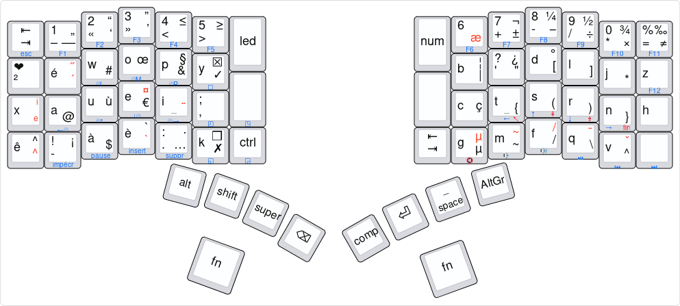

# coeur_io [WIP]

Ma disposition de clavier dérivée des dispositions Cœur 2.0 et Bépo Dev
(toutes deux dérivées du Bépo).

[Éditer](http://www.keyboard-layout-editor.com/#/gists/33e2a01e37e588a0f53d2e2cf759b048)
la disposition (original vide pour le [keyboard.io Model
01](https://community.keyboard.io/) 
[ici](http://www.keyboard-layout-editor.com/#/gists/db6d73c1cadcd6895bd27486e924ae14))

## Inpirations

- Placement des lettres d'après la disposition [Cœur
    2.0](https://hal.archives-ouvertes.fr/hal-01558613/ "Kouroch Bellis.
    La disposition Coeur 2.0 (ÉWOPY) comme disposition de clavier
    bureautique français : Réponse à l’enquête publique de l’AFNOR pour
    une norme PR NF Z71-300. [Rapport de recherche] AFNOR. 2017.
    <hal-01558613>") de Kouroch Bellis.
- Rangée numérique inspirée de la disposition [BÉPO
  1.0rc2](http://bepo.fr/wiki/Accueil) d'Ergodis.
- Accès en Alt-Gr aux caractères pour la programmation d'après la
  disposition [BÉPO_dev](https://github.com/c4software/bepo_developpeur)
  de c4software
- Placement de la rangée du bas d'après [Platypux
  BÉPO](https://community.keyboard.io/t/share-your-layout/296/25).

## Complétion et améliorations

- Il reste plein de places vides !!
- À terme, ce dépot inclura les fichiers des dispositions originales.

## Licence

CC-BY-SA et GFDL comme les œuvres originales sur lesquels cette
disposition est basée.
